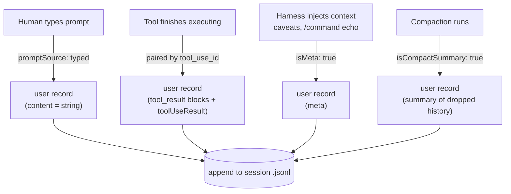
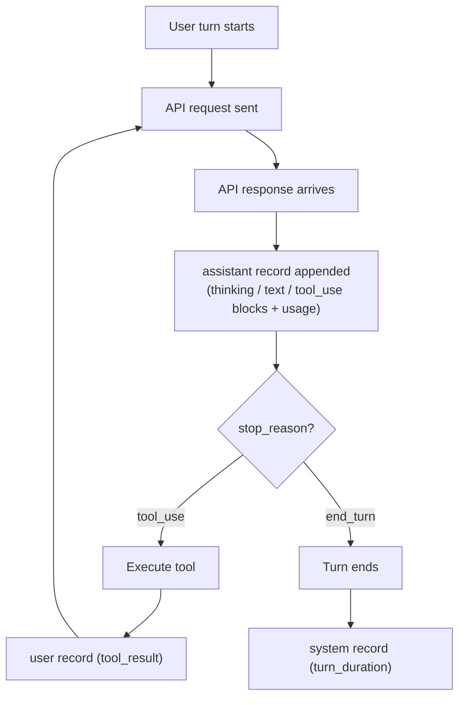
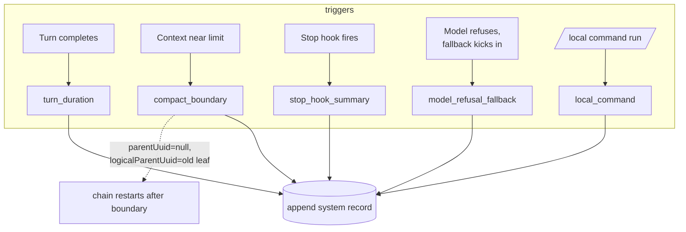
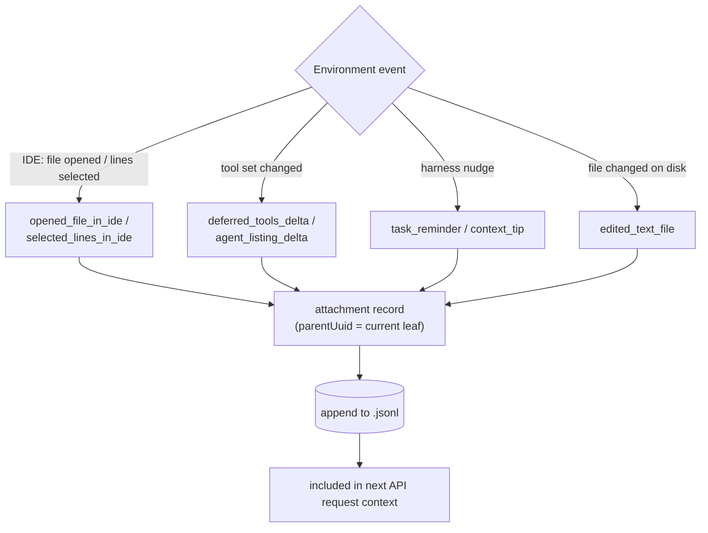
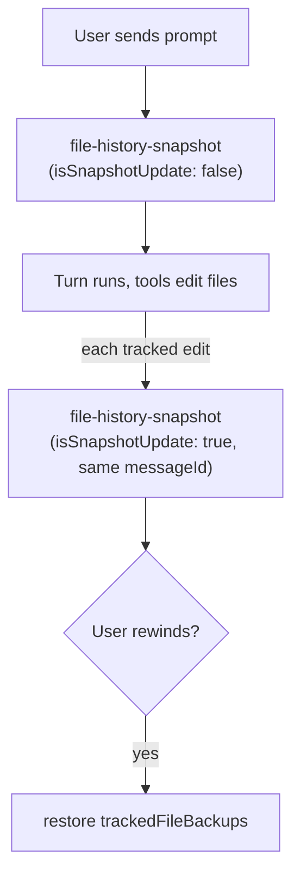
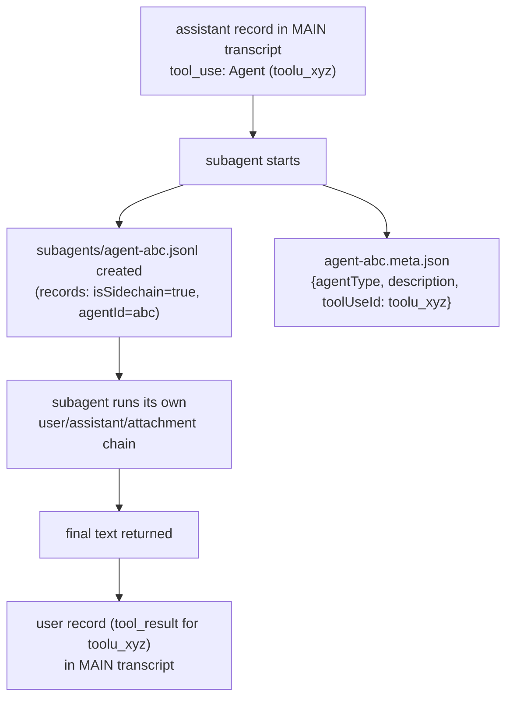

# Claude Code Session JSONL — Message Reference

Every Claude Code session is persisted as an append-only JSONL file (one JSON object per line). This document catalogs **every record type** observed in real session files, what each is used for, and the flow that produces it.

> Source: empirical analysis of 379 session files under `~/.claude/projects/` (Claude Code v2.1.x), cross-checked against the [Agent SDK docs](https://code.claude.com/docs/en/agent-sdk/overview). The format is internal and undocumented — treat this as observed behavior, not a stable API.

## Where sessions live

```
~/.claude/projects/
└── -home-locch-Works-clear-mind/          # cwd with "/" replaced by "-"
    ├── 89641573-e8f3-....jsonl            # one file per session, named by session UUID
    ├── 89641573-e8f3-.../                 # optional sibling dir (same name, no extension)
    │   ├── subagents/
    │   │   ├── agent-<agentId>.jsonl      # each subagent's own transcript
    │   │   ├── agent-<agentId>.meta.json  # {agentType, description, toolUseId}
    │   │   └── workflows/wf_<id>/         # workflow-spawned agents + journal.jsonl
    │   ├── tool-results/*.txt             # large tool outputs offloaded to disk
    │   └── workflows/wf_<id>.json         # workflow scripts
    └── memory/                            # project memory (not part of transcript)
```

## The record shapes

A session file is one append-only log read by two very different consumers. The **conversation** (what the user typed, what the model said, tool calls) has to be reconstructed in order as a tree, so those lines carry chain pointers (`uuid`/`parentUuid`). The **UI state** (current mode, session title, last prompt preview) only needs "what's the current value right now" — no chaining, no tree, just the latest line of that type. Two different jobs, so the file ends up with two structurally different kinds of lines living side by side.

```
{"type":"mode","mode":"normal","sessionId":"89641573-..."}
{"type":"user","uuid":"a2e0-...","parentUuid":null,"message":{"role":"user","content":"hi"}}
{"type":"assistant","uuid":"b3f1-...","parentUuid":"a2e0-...","message":{"role":"assistant","content":[...]}}
{"type":"mode","mode":"plan","sessionId":"89641573-..."}
```

`mode` lines are flat and standalone; `user`/`assistant` lines chain to each other via `uuid`/`parentUuid`. Same file, two shapes, mixed freely by write order.

### `uuid` / `parentUuid`: the chain

`uuid` is a record's own id. `parentUuid` is the `uuid` of the record immediately before it — walking that pointer rebuilds the conversation in order.

All four conversation types carry it, not just `user`/`assistant`: `system` and `attachment` records chain in too, because they're part of what gets replayed back to the model — every one of them needs an exact position. Metadata records (`mode`, `ai-title`, …) never carry it; they're read independently by the UI, not replayed to the model, so they have no position to track.

It's usually one straight chain, but it can branch into a tree: editing or rewinding to an earlier message makes the new record's `parentUuid` point back at that earlier `uuid` instead of the latest one, leaving both branches in the file. `last-prompt.leafUuid` marks which branch is active. Full branching diagram in `session-jsonl-mechanics.md` section 3.

Records come in three shapes:

1. **Conversation records** (`user`, `assistant`, `system`, `attachment`) — full envelope, part of the message DAG:

| Field | Meaning |
|---|---|
| `uuid` | unique id of this record |
| `parentUuid` | id of the previous record in the chain (`null` = chain root) |
| `logicalParentUuid` | only on `compact_boundary`; preserves the logical link to pre-compact history when `parentUuid` is reset to `null` |
| `requestId` | id of the API request that produced this record (`assistant` records only) |
| `type` | record type |
| `timestamp` | ISO-8601 write time |
| `sessionId` | owning session UUID (newer records also carry legacy `session_id`) |
| `isSidechain` | `true` only inside subagent transcript files |
| `isMeta` | `true` = injected context, not something the user actually typed |
| `cwd`, `gitBranch`, `version` | working dir, git branch, Claude Code version at write time |
| `userType`, `entrypoint` | `"external"`, `"cli"` (or SDK entrypoints) |
| `promptId` | groups all records belonging to one user turn |

2. **Session-metadata records** (`mode`, `permission-mode`, `ai-title`, `custom-title`, `last-prompt`, `agent-name`, `pr-link`, `queue-operation`) — tiny, no envelope, just `type` + payload + `sessionId`. They are **appended again each time the value changes; the last occurrence wins**.

3. **`file-history-snapshot`** fits neither shape: no `uuid`/`parentUuid` chain (so not shape 1), but also not "latest wins" — every edit appends a new record rather than replacing the last one (so not shape 2 either). See [section 5](#5-file-history-snapshot--rewind-checkpoints). The table below tags it `infra` to flag that difference.

## Record type overview

| type | count seen | category | purpose |
|---|--:|---|---|
| `assistant` | 13,925 | conversation | model output: text, thinking, tool calls, token usage |
| `user` | 8,812 | conversation | user prompts **and** tool results (both have `role: user`) |
| `attachment` | 3,426 | conversation | harness-injected context (26 subtypes) |
| `system` | 1,772 | conversation | harness events (9 subtypes: durations, compaction, hooks…) |
| `file-history-snapshot` | 2,101 | infra | file-backup checkpoints for rewind/undo |
| `last-prompt` | 2,305 | metadata | latest user prompt (for session-picker preview) |
| `mode` | 2,076 | metadata | UI mode (normal / plan …) |
| `permission-mode` | 2,027 | metadata | permission mode (auto / manual …) |
| `ai-title` | 1,564 | metadata | auto-generated session title |
| `queue-operation` | 1,093 | metadata | message-queue events (enqueue/dequeue/remove/popAll) |
| `agent-name` | 44 | metadata | name assigned to a background agent session |
| `custom-title` | 23 | metadata | user-set session title (overrides `ai-title`) |
| `pr-link` | 1 | metadata | PR created from this session |

---

## 1. `user` — user turns and tool results

The most overloaded type. `message.role` is always `"user"`, but there are four distinct variants, distinguishable by fields:

| Variant | How to detect | What it is |
|---|---|---|
| Typed prompt | `message.content` is a string, `origin.kind == "human"` / `promptSource: "typed"` | what the human actually typed |
| Tool result | `message.content` is a list with `tool_result` blocks; has `toolUseResult` + `sourceToolAssistantUUID` | output of a tool call, sent back as a user message (API convention) |
| Meta/injected | `isMeta: true` | caveats, local-command echoes, hook-injected context — never typed by the user |
| Compact summary | `isCompactSummary: true` | the summary message that replaces compacted history |

Other observed fields: `promptSource` (`typed` / `sdk` / `queued` / `system` / `suggestion_accepted`), `origin` (`{kind: "human"}` / `{kind: "task-notification"}`), `interruptedMessageId` (set when the user interrupted a running turn).

**Tool-result example** — note the *two* representations of the same result:

```json
{
  "type": "user",
  "parentUuid": "<uuid of assistant msg that called the tool>",
  "sourceToolAssistantUUID": "<same>",
  "message": {
    "role": "user",
    "content": [
      { "type": "tool_result", "tool_use_id": "toolu_01R2...", "content": "1\t# clear-mind\n..." }
    ]
  },
  "toolUseResult": {
    "type": "text",
    "file": { "filePath": "...", "numLines": 21, "startLine": 1, "totalLines": 21, "content": "..." }
  }
}
```

- `message.content[].content` — the **flattened string the model saw**
- `toolUseResult` — the **structured result** (per-tool schema: file info for Read, stdout/stderr for Bash, …). Richer and better for programmatic analysis.



## 2. `assistant` — model output

One record **per API response** in a turn — a turn with 5 tool calls produces ≥6 assistant records, all sharing the turn's `promptId` chain. Carries `requestId` and the full API `message`:

- `message.content[]` blocks: `thinking` (with cryptographic `signature`), `text`, `tool_use` (`{id, name, input, caller}`)
- `message.stop_reason`: `tool_use` (wants a tool) or `end_turn` (done)
- `message.usage` — **the cost/token record**:

```json
"usage": {
  "input_tokens": 2,
  "output_tokens": 182,
  "cache_creation_input_tokens": 13784,
  "cache_read_input_tokens": 27740,
  "cache_creation": { "ephemeral_1h_input_tokens": 13784, "ephemeral_5m_input_tokens": 0 },
  "service_tier": "standard",
  "server_tool_use": { "web_search_requests": 0, "web_fetch_requests": 0 },
  "iterations": [ ... ],
  "speed": "standard"
}
```

Summing `usage` across all `assistant` records = the session's exact token/cost profile. This is the raw data for clear-mind's **Cost** and **Token Usage** monitors.



## 3. `system` — harness events

Envelope like conversation records, plus `subtype`, `content`, and often `level` (`info` / `warning` / `suggestion`).

| subtype | seen | when it's written |
|---|--:|---|
| `turn_duration` | 1,541 | after every completed turn — `durationMs`, `messageCount` |
| `away_summary` | 146 | summary generated while the user was away |
| `stop_hook_summary` | 29 | a Stop hook ran — `hookCount`, `hookInfos[]`, `preventedContinuation` |
| `model_refusal_fallback` | 15 | safeguard refusal triggered fallback to another model — `originalModel`, `fallbackModel`, `retractedMessageUuids[]` |
| `compact_boundary` | 15 | context compaction — see below |
| `local_command` | 14 | user ran a local `/command` — `content` holds command name/args |
| `scheduled_task_fire` | 8 | a scheduled task/wakeup fired |
| `informational` | 3 | misc notices |
| `agents_killed` | 1 | background agents were terminated |

**`compact_boundary` is the most important one** — it marks a context-window compaction and is the only record where the parent chain deliberately breaks:

```json
{
  "type": "system", "subtype": "compact_boundary",
  "parentUuid": null,
  "logicalParentUuid": "<uuid of last pre-compact message>",
  "compactMetadata": {
    "trigger": "auto",
    "preTokens": 199173, "postTokens": 136769,
    "durationMs": 57203,
    "preservedSegment": { "headUuid": "...", "anchorUuid": "...", "tailUuid": "..." },
    "preservedMessages": { "uuids": ["..."] }
  }
}
```

`parentUuid: null` restarts the physical chain; `logicalParentUuid` preserves the logical link to pre-compact history. `preTokens → postTokens` tells you exactly how many tokens compaction reclaimed — direct input for a **Token blowout** monitor.



## 4. `attachment` — harness-injected context

Context the harness attaches to the conversation without the user typing it. `attachment.type` observed values (26):

| attachment.type | seen | what it injects |
|---|--:|---|
| `task_reminder` | 824 | "consider using task tools" nudges |
| `skill_listing` | 398 | available skills list |
| `agent_listing_delta` | 388 | changes to available agent types |
| `deferred_tools_delta` | 352 | tool names added/removed from the deferred set |
| `opened_file_in_ide` | 312 | user opened a file in the IDE |
| `mcp_instructions_delta` | 242 | MCP server instruction changes |
| `edited_text_file` | 212 | a file was modified outside the conversation |
| `queued_command` | 118 | a queued message was delivered |
| `command_permissions` | 116 | permission/allowlist info |
| `diagnostics` | 113 | IDE diagnostics (lint/type errors) |
| `selected_lines_in_ide` | 106 | user selected lines in the IDE |
| `auto_mode` | 68 | auto-mode status |
| `goal_status` | 64 | active `/goal` state |
| `file` / `directory` | 59 | file/dir content attached (e.g. `@`-mention) |
| `context_tip` | 15 | usage tips |
| `date_change` | 9 | date rolled over mid-session |
| `invoked_skills` | 8 | skill invocation context |
| `compact_file_reference` | 7 | file references preserved across compaction |
| `nested_memory` | 4 | memory-dir content |
| `read_truncation_notice` | 2 | a Read result was truncated |
| `plan_mode` / `plan_mode_exit` | 4 | plan-mode transitions |
| `ultra_effort_enter` / `ultra_effort_exit` | 3 | effort-level transitions |
| `dynamic_skill` | 2 | dynamically loaded skill |

These are the main source of **context pollution**: bookkeeping tokens the model must read but that carry no task content. Counting attachment tokens vs. conversation tokens is a first-class "detox" metric.



## 5. `file-history-snapshot` — rewind checkpoints

Written at the start of a user turn; backs the "rewind/undo file changes" feature.

```json
{
  "type": "file-history-snapshot",
  "messageId": "<uuid of the user message it precedes>",
  "snapshot": { "messageId": "...", "trackedFileBackups": { }, "timestamp": "..." },
  "isSnapshotUpdate": false
}
```

`trackedFileBackups` maps file paths to backup metadata as tools modify files during the turn. Updates are **appended** as new records with `isSnapshotUpdate: true` (never edited in place).

Note what's absent: no `sessionId`, no `uuid`/`parentUuid`. Confirmed against real session files — this isn't a truncated example, the type genuinely carries none of the envelope fields. `messageId` is the only link back to the conversation.



## 6. Session-metadata records

All follow the same trivial pattern: **event → append `{type, payload, sessionId}` → readers take the last occurrence**.

| type | payload | written when |
|---|---|---|
| `mode` | `mode: "normal"` | UI mode changes (also once at session start) |
| `permission-mode` | `permissionMode: "auto"` | permission mode changes |
| `ai-title` | `aiTitle: "Study Ponytail GitHub repository"` | auto-title generated/regenerated as topic drifts |
| `custom-title` | `customTitle: "My renamed session"` | user renames the session |
| `last-prompt` | `lastPrompt: "...", leafUuid: "..."` | after each user prompt — powers session-picker preview; `leafUuid` = current DAG leaf |
| `agent-name` | `agentName: "implement-archive-loop"` | a named background agent session starts |
| `pr-link` | `prNumber, prUrl, prRepository` | a PR is created from the session |
| `queue-operation` | `operation: enqueue/dequeue/remove/popAll, content` | user queues messages while the agent is busy |

```mermaid
flowchart LR
    EV{state change} -->|mode switch| M[mode / permission-mode]
    EV -->|title (re)generated| T[ai-title / custom-title]
    EV -->|prompt sent| L[last-prompt + leafUuid]
    EV -->|msg queued while busy| Q[queue-operation]
    EV -->|PR created| P[pr-link]
    M & T & L & Q & P --> A[(append; latest wins on read)]
```

## Content-block reference (inside `message.content[]`)

| block type | in | fields | notes |
|---|---|---|---|
| `text` | assistant | `text` | visible reply |
| `thinking` | assistant | `thinking`, `signature` | extended reasoning; signature authenticates it on resume |
| `tool_use` | assistant | `id`, `name`, `input`, `caller` | `caller.type: "direct"` = main loop (vs. subagent) |
| `tool_result` | user | `tool_use_id`, `content`, `is_error?` | paired to its `tool_use` by id |

## Subagent transcripts

Subagent (Task/Agent tool, workflows) transcripts are **not inlined** in the main session file. Each gets its own file:

```
<project>/<sessionId>/subagents/agent-<agentId>.jsonl        # same record format
<project>/<sessionId>/subagents/agent-<agentId>.meta.json    # {agentType, description, toolUseId}
<project>/<sessionId>/subagents/workflows/wf_<id>/...        # workflow agents + journal.jsonl
```

Records inside are identical in shape but have `isSidechain: true` and an extra `agentId` field, and share the parent's `sessionId`. The `meta.json`'s `toolUseId` links the subagent back to the exact `tool_use` block in the parent transcript that spawned it.


