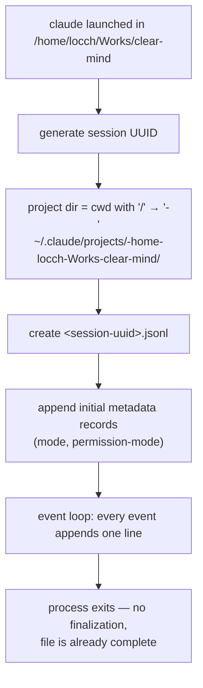
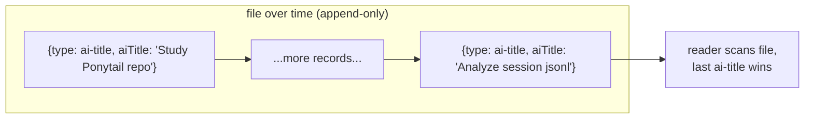
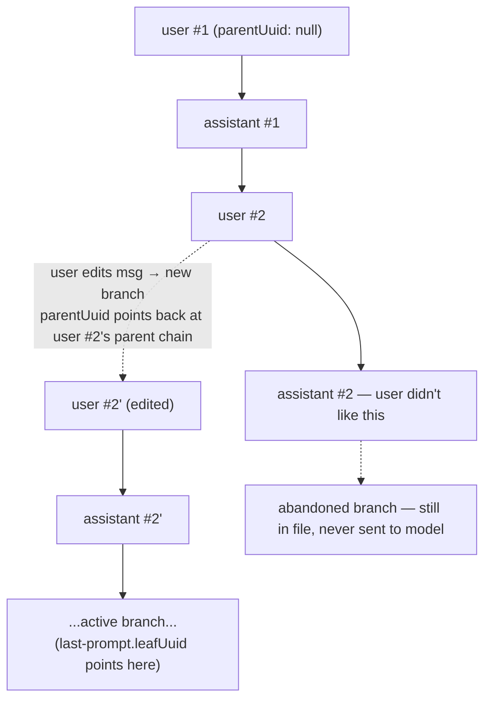
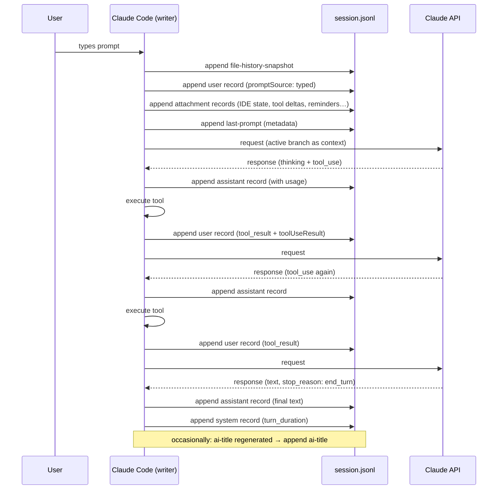
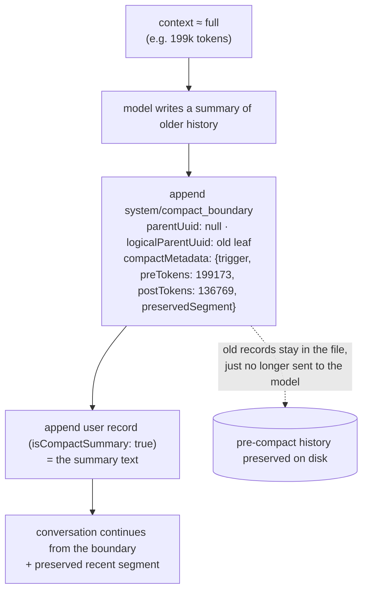

# Session JSONL — Creation, Update & Consumption Mechanics

Companion to [session-jsonl-format.md](session-jsonl-format.md) (the record catalog). This doc covers **how the file comes to exist, how records get added, how "updates" work, and how to use it** — including the Agent SDK relationship and what it means for clear-mind.

## 1. Creation lifecycle

A session file is created lazily when the first record is written (typically at session start):



Key properties:

- **One writer**: the Claude Code process owns the file for the session's lifetime.
- **Append-only**: every event is one `JSON.stringify(record) + "\n"` appended to the end. Existing lines are **never modified or deleted**. This is why the file is always valid and crash-safe — a crash loses at most the last partial line.
- **No finalization**: there is no "session end" footer. A session is "over" when nothing appends anymore; it can be resumed at any time by appending more.

## 2. The update mechanism: append-latest-wins

Nothing is ever updated in place. "Updating" a value means **appending a new record of the same type**; readers scan the file and keep the last occurrence:

- `ai-title` appears up to 12× in one session — the title regenerates as the topic drifts; the last one is the current title.
- `mode` / `permission-mode` re-append on every switch (observed >1 per file in 100 files).
- `last-prompt` re-appends after every user prompt.
- `file-history-snapshot` appends follow-ups with `isSnapshotUpdate: true` and the same `messageId` rather than editing the original snapshot.



This is an **event-sourcing** design: the file is a log of facts, and any "current state" (title, mode, queue contents, file backups) is derived by replaying it.

## 3. The conversation DAG: `uuid` / `parentUuid`

Conversation records don't form a flat list — they form a **linked tree**:

- every `user`/`assistant`/`system`/`attachment` record has a `uuid` and a `parentUuid` pointing at the record it follows
- the first record of a session has `parentUuid: null`
- **branching**: when the user edits/rewinds to an earlier message, the new branch's first record points at that earlier `uuid` — both branches remain in the file; only the active branch is sent to the model
- `last-prompt.leafUuid` tells you which leaf is the active branch head
- `promptId` groups every record produced by one user turn
- tool results link back two ways: `parentUuid` (chain position) and `sourceToolAssistantUUID` (+ block-level `tool_use_id`) to the assistant record that requested them



## 4. Anatomy of one turn (full sequence)

What actually lands in the file when you send one message that triggers two tool calls:



## 5. Compaction

When context approaches the window limit (or the user runs `/compact`):



Crucial detail for analysis tools: **the jsonl keeps the full pre-compact history** — only the model's view shrinks. `preTokens - postTokens` is the reclaimed amount; `preservedSegment` lists exactly which recent uuids survived verbatim.

## 6. How each kind of record gets added (writer map)

| Trigger | Records appended |
|---|---|
| Session start | `mode`, `permission-mode` |
| User sends prompt | `file-history-snapshot`, `user`, `attachment`*, `last-prompt` |
| API response arrives | `assistant` |
| Tool finishes | `user` (tool_result) |
| Turn completes | `system/turn_duration` |
| File edited by tool | `file-history-snapshot` (`isSnapshotUpdate: true`) |
| IDE activity | `attachment` (opened_file / selected_lines / diagnostics) |
| Mode/permission switch | `mode` / `permission-mode` |
| Title (re)generated / renamed | `ai-title` / `custom-title` |
| User queues msg while agent busy | `queue-operation` (enqueue → dequeue/remove/popAll) |
| Compaction | `system/compact_boundary` + `user` (isCompactSummary) |
| Stop hook runs | `system/stop_hook_summary` |
| Model refusal fallback | `system/model_refusal_fallback` |
| `/command` executed locally | `system/local_command` |
| Subagent spawned | *nothing in main file* — new `subagents/agent-<id>.jsonl` + `.meta.json`; result returns as a normal tool_result |
| PR created | `pr-link` |

**Can external tools add records?** Mechanically yes — it's just a text append, and readers (resume, session picker) will pick it up. Safe only when the session is not live (single-writer assumption; concurrent appends risk interleaved partial lines). For clear-mind: treat live session files as **read-only streams** (tail them like `tail -f`), and write derived data (annotations, detox verdicts, fact cache) to your own sidecar files, keyed by record `uuid` — never mutate the transcript itself.

## 7. Relationship to the Agent SDK

The [Agent SDK](https://code.claude.com/docs/en/agent-sdk/overview) is Claude Code as a library; **session state is explicitly "JSONL on your filesystem"** — the same files documented here (`promptSource: "sdk"` marks SDK-driven prompts; 329 observed).

| SDK concept | jsonl counterpart |
|---|---|
| `SystemMessage(subtype="init")` with `session_id` | the session UUID = the filename |
| `AssistantMessage` / `UserMessage` stream items | `assistant` / `user` records (same API shapes inside `message`) |
| `ResultMessage` (final result + cost) | derived from the last `assistant` + summed `usage` (not a stored record) |
| `options.resume = session_id` | reopen the file, replay active branch as context, keep appending |
| fork session | new file, new session UUID, history copied as context |
| subagent `parent_tool_use_id` | `meta.json.toolUseId` + `agentId` on sidechain records |
| Hooks (`SessionStart`, `PreToolUse`, …) | run around the same events that produce records; hook-injected context surfaces as `isMeta` user records / attachments |

So anything built on parsing these files works for both interactive Claude Code sessions **and** headless SDK agents — same format, same directories.

## 8. Usage — what you can build from this file (clear-mind mapping)

| clear-mind feature | jsonl source |
|---|---|
| **Visualize session** | replay records, rebuild DAG via `uuid`/`parentUuid`, group by `promptId`, render branches + sidechain files |
| **Cost / Token Usage** | sum `assistant.message.usage` (input, output, cache_creation, cache_read; 1h vs 5m ephemeral split) |
| **Token blowout** | per-turn usage deltas; `compact_boundary.compactMetadata.preTokens/postTokens`; attachment-token share |
| **Loss in middle** | distance (in tokens) between where a fact entered (tool_result uuid) and where it was used/needed again |
| **Verification debt** | `tool_use` Edit/Write records not followed by a verifying Bash/Read/test before `end_turn` |
| **Comprehension rot** | repeated Reads of the same `filePath` (from `toolUseResult.file`) across the session |
| **Cognitive surrender** | `turn_duration.durationMs` high while assistant text tokens low; interrupt records (`interruptedMessageId`) |
| **Context detox** | tool_result size vs. how much of it the following assistant text references; `attachment` bookkeeping share; superseded tool results (same file read twice → first is dead weight) |
| **Fact cache** | key: `(tool name, canonical input)` from `tool_use`; value: `toolUseResult`; invalidate on `edited_text_file` attachments / `file-history-snapshot` changes |

### Minimal reader (reference implementation)

```python
import json, collections

def read_session(path):
    records, by_uuid = [], {}
    for line in open(path):
        line = line.strip()
        if not line:
            continue
        d = json.loads(line)
        records.append(d)
        if "uuid" in d:
            by_uuid[d["uuid"]] = d
    return records, by_uuid

def latest(records, rtype, field):
    """append-latest-wins metadata lookup"""
    vals = [r[field] for r in records if r.get("type") == rtype]
    return vals[-1] if vals else None

def active_branch(records, by_uuid):
    """walk back from the current leaf to the root"""
    leaf = latest(records, "last-prompt", "leafUuid")
    chain, cur = [], by_uuid.get(leaf)
    while cur:
        chain.append(cur)
        cur = by_uuid.get(cur.get("parentUuid") or cur.get("logicalParentUuid"))
    return list(reversed(chain))

def usage_rollup(records):
    total = collections.Counter()
    for r in records:
        if r.get("type") == "assistant":
            u = r["message"].get("usage") or {}
            for k in ("input_tokens", "output_tokens",
                      "cache_creation_input_tokens", "cache_read_input_tokens"):
                total[k] += u.get(k, 0)
    return dict(total)

records, by_uuid = read_session("~/.claude/projects/<proj>/<session>.jsonl")
print(latest(records, "ai-title", "aiTitle"))
print(usage_rollup(records))
```

## 9. Caveats

- **Undocumented internal format** — fields appear/disappear between Claude Code versions (each record carries `version`; the corpus here spans 2.1.177–2.1.207). Parse defensively: unknown `type`s and fields must not crash a reader.
- `session_id` (snake) and `sessionId` (camel) coexist on newer records; older records may have only one.
- `thinking` blocks may be empty strings with only a `signature` (redacted-at-rest); don't assume content.
- Large tool outputs may be offloaded to `<session>/tool-results/*.txt` and referenced rather than inlined.
- Subagent transcripts multiply real cost: a session's true token usage = main file + all `subagents/*.jsonl` rollups.
